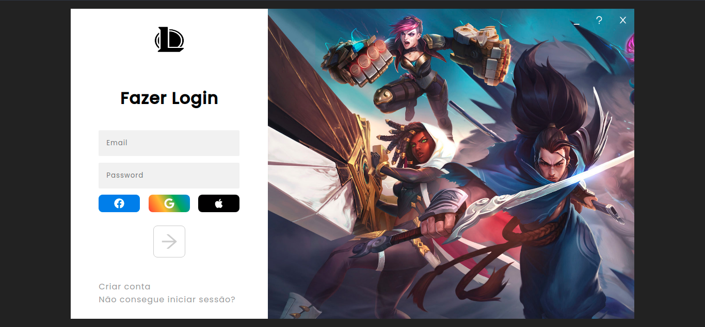

<h1 align=center>League of Legends</h1>
<h3 align=center>Launcher Web</h3>
<p></p>

<h3 align=center>Begin</h3>

```bash
# Run to instal dependecies and start on localhost:3000
yarn && yarn dev

npm install && npm run dev
```